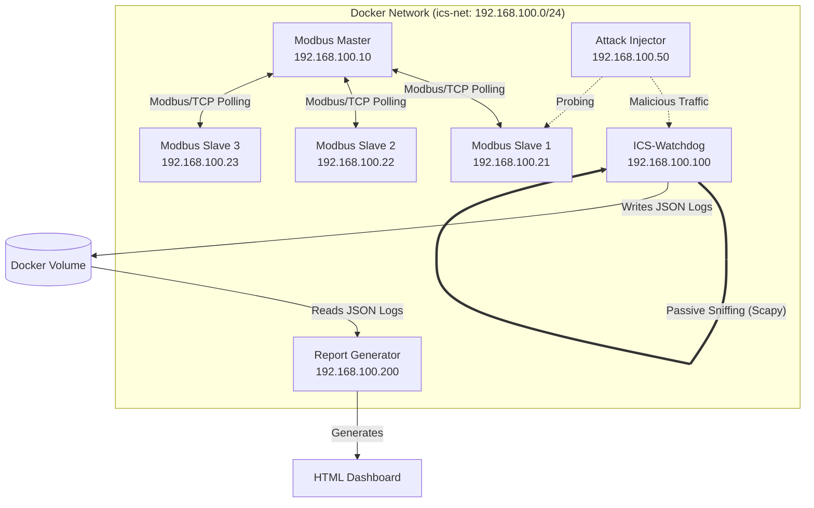

# ICS-Watchdog: Passive Modbus/TCP Security Monitor

[](https://opensource.org/licenses/MIT)
[](https://www.python.org/)
[](https://www.docker.com/)
[](https://scapy.net/)

**ICS-Watchdog** is a lightweight, containerised passive security monitoring tool designed specifically for Operational Technology (OT) and Industrial Control System (ICS) networks. It analyses Modbus/TCP traffic in real-time without disrupting sensitive industrial equipment, detecting reconnaissance, malicious commands, and network anomalies mapped to the **MITRE ATT&CK® for ICS** framework.

---

## Architecture overview

The project is built as a complete, self-contained Docker environment. It provides not just the monitoring tool, but an entire simulated ICS network (a honeypot) and an automated attack injector to prove the detection capabilities work.



### The 6 Core Components

1. **Modbus Master (`ics-master`)**: Acts as the legitimate HMI/SCADA controller. It constantly polls the slaves for their holding registers (FC03) every second.
2. **Modbus Slaves (`ics-slave-1,2,3`)**: Simulated PLCs/RTUs running Modbus/TCP servers on port 502. They hold simulated physical data.
3. **Traffic Injector (`ics-injector`)**: A Python-based CLI tool used to launch simulated cyber attacks against the ICS network.
4. **ICS-Watchdog (`ics-watchdog`)**: The core security engine. It binds to the Docker bridge network in promiscuous mode to passively sniff traffic and evaluate it against stateful security rules.
5. **Reporter (`ics-reporter`)**: A container that spins up on-demand to ingest the raw Watchdog telemetry and generate a beautiful HTML dashboard.
6. **Shared Volume (`watchdog-data`)**: A Docker volume used to pass the raw telemetry (`alerts.jsonl` and `packet_stats.json`) from the Watchdog to the Reporter.

---

## Detection Rules & MITRE ICS Mapping

ICS-Watchdog currently ships with a stateful engine evaluating 8 core detection rules. These rules are designed to catch complex behaviours across time windows, not just single malicious packets.

| Rule ID | Rule Name | MITRE ICS Technique | Detection Logic |
|---------|-----------|---------------------|-----------------|
| **R-001** | Modbus Function Code Scan | [T0846](https://attack.mitre.org/techniques/T0846/) (Remote System Discovery) | >10 distinct function codes from the same source IP within 30s. |
| **R-002** | Unauthorised Coil Write | [T0855](https://attack.mitre.org/techniques/T0855/) (Unauthorized Command Message) | FC05 (Write Coil) or FC15 from any non-master IP address. |
| **R-003** | Register Read Flood | [T0884](https://attack.mitre.org/techniques/T0884/) (Connection Probe) | >50 FC03 read requests from the same source IP within 10s. |
| **R-004** | Sequential Scan Probe | [T0846](https://attack.mitre.org/techniques/T0846/) (Remote System Discovery) | A broadcast packet OR a sequential scan of all 3 slave IPs/Unit IDs in 5s. |
| **R-005** | Out-of-Range Access | [T0855](https://attack.mitre.org/techniques/T0855/) (Unauthorized Command Message) | Requesting a register address > 9 (outside the simulated PLC limits). |
| **R-006** | New Source IP | [T0843](https://attack.mitre.org/techniques/T0843/) (Program Download) | Any Modbus traffic observed from an IP not in the known-devices allowlist. |
| **R-007** | Replay Attack | [T0856](https://attack.mitre.org/techniques/T0856/) (Spoof Reporting Message) | Identical Modbus packet payload (byte-for-byte) retransmitted >3 times in 5s. |
| **R-008** | Excessive Write Rate | [T0855](https://attack.mitre.org/techniques/T0855/) (Unauthorized Command Message) | >20 write commands (FC05/06/15/16) from a single source in under 10s. |

---

## Quick Start Guide

### 1. Build and Start the Environment
Clone the repository and spin up the Docker stack. This will build the Python environments and start the simulated ICS network.
```bash
git clone https://github.com/arnavparekar/ics-watchdog.git
cd ics-watchdog

# Build and start all containers in the background
docker-compose up -d --build
```
*Note: The Watchdog will immediately start sniffing the network and logging legitimate polling traffic.*

### 2. Run Attack Scenarios
The project includes a built-in `ics-injector` to prove the detection engine works. Run any of the following attacks:

```bash
# Attack 1: Reconnaissance Scan
# Sweeps the network, fuzzes function codes, and attempts out-of-bounds reads.
# Triggers: R-001, R-004, R-005, R-006
docker exec ics-injector python3 inject.py --attack recon

# Attack 2: Coil Write Injection
# Rapidly issues unauthorised FC05 commands to simulate actuating physical relays.
# Triggers: R-002, R-006, R-008
docker exec ics-injector python3 inject.py --attack coil-inject

# Attack 3: Replay Attack
# Uses Scapy to bypass TCP sequence numbers and replay an identical FC06 packet.
# Triggers: R-007, R-008
docker exec ics-injector python3 inject.py --attack replay
```

### 3. Generate the HTML Security Dashboard
The Watchdog passively logs all network telemetry to a shared volume. To compile this raw telemetry into a beautiful, human-readable HTML dashboard:

```bash
# Run the report generator container
docker run --rm -v ics-watchdog_watchdog-data:/app/output ics-watchdog-report-gen python3 report.py
```
This generates `watchdog_report.html` and `watchdog_report.json` in the Docker volume. You can view the sample outputs directly in the [`samples/`](samples/) directory of this repository!

---

## Sample Output

ICS-Watchdog features a premium, cybersecurity-themed HTML dashboard with `Chart.js` integrations for visualising alert severities and Modbus function code distributions.

Check out the sample dashboard here: **[`samples/watchdog_report.html`](samples/watchdog_report.html)**

---

## License

This project is licensed under the MIT License - see the [LICENSE](LICENSE) file for details.
