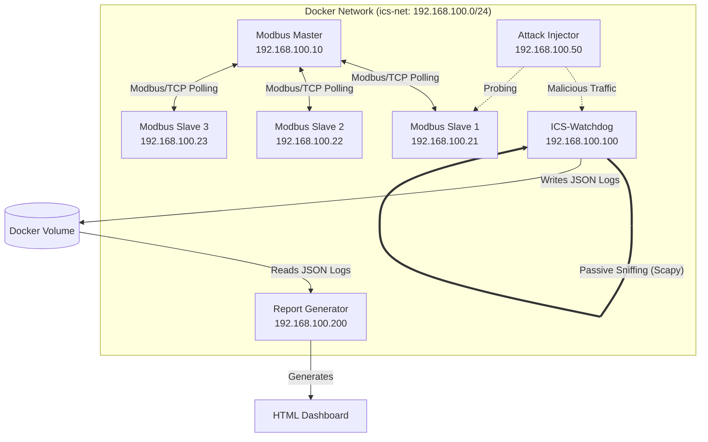

# ICS-Watchdog

[](https://opensource.org/licenses/MIT)
[](https://www.python.org/)
[](https://www.docker.com/)
[](https://scapy.net/)
[](https://attack.mitre.org/matrices/ics/)

A lightweight, containerised **passive security monitor** for Operational Technology (OT) networks. ICS-Watchdog sniffs Modbus/TCP traffic in real-time without generating a single probe packet, runs a stateful rule engine against the captured data, and produces a structured JSON + HTML security report with detections mapped to the [MITRE ATT&CK® for ICS](https://attack.mitre.org/matrices/ics/) framework.

---

## Table of Contents

- [Background](#background)
- [Project Architecture](#project-architecture)
- [Directory Structure](#directory-structure)
- [Detection Rules](#detection-rules)
- [Attack Scenarios](#attack-scenarios)
- [Quick Start](#quick-start)
- [Sample Output](#sample-output)
- [How It Works](#how-it-works)
- [License](#license)

---

## Background

Industrial Control Systems (ICS) and Operational Technology (OT) networks — factory floors, power grids, water treatment plants — run protocols that were designed for reliability, **not security**. Modbus/TCP, one of the most widely deployed ICS protocols, transmits all commands in plaintext with no authentication and no source verification.

A legitimate Modbus Master (HMI/SCADA) sends `Read Holding Registers (FC03)` requests to PLCs and RTUs every few seconds. An attacker who gains access to the same network segment can send identical-looking packets to force a valve open, disable a safety interlock, or replay a command sequence captured minutes earlier — and there is nothing in Modbus itself to stop them.

**ICS-Watchdog** solves this by sitting passively on the wire, learning what "normal" looks like, and raising a MITRE-mapped alert the moment traffic deviates from expected behaviour.

---

## Project Architecture

The project ships as a complete, self-contained Docker Compose environment. It includes not just the monitoring engine, but an entire **simulated ICS honeypot** and an **automated attack injector** so the detection rules can be exercised and verified without needing real hardware.



### Containers

| Container | IP | Role |
|---|---|---|
| `ics-master` | `192.168.100.10` | Legitimate Modbus Master — polls slaves every second using FC03, simulating a real SCADA/HMI workstation. |
| `ics-slave-1` | `192.168.100.21` | Modbus/TCP server (PLC/RTU). Holds 10 holding registers with simulated sensor data. |
| `ics-slave-2` | `192.168.100.22` | Modbus/TCP server (PLC/RTU). |
| `ics-slave-3` | `192.168.100.23` | Modbus/TCP server (PLC/RTU). |
| `ics-injector` | `192.168.100.50` | Attack injector. Stays idle at startup; attacks are triggered manually via `docker exec`. |
| `ics-watchdog` | `192.168.100.100` | The core security engine. Runs Scapy in promiscuous mode, parses Modbus/TCP MBAP headers, feeds packets into the stateful rule engine, and writes `alerts.jsonl` and `packet_stats.json` to the shared volume. |
| `ics-reporter` | `192.168.100.200` | On-demand report generator. Reads from the shared volume and produces a `watchdog_report.json` and `watchdog_report.html` dashboard. |

---

## Directory Structure

```
ICS-Watchdog/
├── docker-compose.yml          # Defines all 7 containers and the shared volume
│
├── master/
│   ├── Dockerfile
│   └── master.py               # pymodbus async client; polls slaves with FC03 every 1s
│
├── slave/
│   ├── Dockerfile
│   └── slave.py                # pymodbus async server; SLAVE_ID set via env var
│
├── watchdog/
│   ├── Dockerfile
│   ├── watchdog.py             # Scapy sniffer, packet parser, stats writer
│   ├── rules.py                # Stateful rule engine — R-001 through R-008
│   └── alert.py                # Alert dataclass + JSONL writer
│
├── injector/
│   ├── Dockerfile
│   ├── inject.py               # CLI entry-point: --attack {recon,coil-inject,replay}
│   └── scenarios/
│       ├── recon.py            # Reconnaissance scan (T0846, T0843)
│       ├── coil_inject.py      # Unauthorised coil write burst (T0855)
│       └── replay.py           # Raw Scapy packet replay (T0856)
│
├── reporter/
│   ├── Dockerfile
│   ├── report.py               # Reads JSONL logs, renders JSON + HTML report
│   └── templates/
│       └── report.html.j2      # Jinja2 template — dark dashboard with Chart.js
│
└── samples/
    ├── watchdog_report.json    # Example JSON report generated from a live test run
    └── watchdog_report.html    # Example HTML dashboard (open in any browser)
```

---

## Detection Rules

The rule engine in [`watchdog/rules.py`](watchdog/rules.py) is **stateful** — it maintains sliding-window counters per source IP across packets, not just within individual packets. This lets it detect slow-burn reconnaissance and burst attacks alike.

| Rule | Name | Severity | MITRE Technique | Trigger Condition |
|------|------|----------|-----------------|-------------------|
| **R-001** | Modbus Function Code Scan | HIGH | [T0846](https://attack.mitre.org/techniques/T0846/) Remote System Discovery | >10 **distinct** function codes from the same source IP within 30 s. Normal devices use 1–2 FCs. |
| **R-002** | Unauthorised Coil Write | CRITICAL | [T0855](https://attack.mitre.org/techniques/T0855/) Unauthorized Command Message | FC05 (Write Single Coil) or FC15 (Write Multiple Coils) originating from any IP other than the known master. |
| **R-003** | Register Read Flood | HIGH | [T0884](https://attack.mitre.org/techniques/T0884/) Connection Probe | >50 FC03 Read Holding Registers requests from the same source within 10 s. |
| **R-004** | Sequential Scan Probe | HIGH | [T0846](https://attack.mitre.org/techniques/T0846/) Remote System Discovery | Modbus packet sent to a broadcast address, OR sequential probe of all slave Unit IDs {1, 2, 3} within 5 s. |
| **R-005** | Out-of-Range Register Access | MEDIUM | [T0855](https://attack.mitre.org/techniques/T0855/) Unauthorized Command Message | FC03/FC04 request for a register address > 9 (beyond the configured PLC data model). |
| **R-006** | New Source IP | HIGH | [T0843](https://attack.mitre.org/techniques/T0843/) Program Download | Modbus traffic arriving from an IP not in the static allowlist `{10, 21, 22, 23}`. Fires once per new IP. |
| **R-007** | Replay Attack | CRITICAL | [T0856](https://attack.mitre.org/techniques/T0856/) Spoof Reporting Message | Identical Modbus payload (byte-for-byte, including function code) retransmitted >3 times within 5 s from the same source. |
| **R-008** | Excessive Write Rate | CRITICAL | [T0855](https://attack.mitre.org/techniques/T0855/) Unauthorized Command Message | >20 write-class commands (FC05/FC06/FC15/FC16) from a single source within 10 s. |

---

## Attack Scenarios

Three attack scenarios are included in the `injector` container. Each is self-contained and prints progress to stdout.

### 1. Reconnaissance Scan — `recon`

Simulates an attacker who has just gained network access and wants to map out the ICS topology.

- Connects to each of the three slave IPs and sends 8 pymodbus function codes (FC01–FC06, FC15, FC16).
- Mirrors 4 additional raw function codes (FC07, FC08, FC17, FC23) to the watchdog using Scapy — pushing the distinct FC count above the R-001 threshold of 10.
- Requests register address 50 on each slave (above the 0–9 limit) to trigger R-005.
- The injector IP (`192.168.100.50`) is not in the allowlist, so R-006 fires on the first packet.
- After probing all three Unit IDs in sequence, R-004 fires.

**Expected rules triggered:** R-001, R-004, R-005, R-006

### 2. Coil Write Injection — `coil-inject`

Simulates an attacker attempting to actuate physical relays or valves by overwriting coil states.

- Sends 30 rapid FC05 (Write Single Coil) commands to slave-1 with a 50 ms delay between each.
- Simultaneously mirrors each write to the watchdog for capture.
- The 30 writes in ~1.5 s triggers R-008 (>20 writes / 10 s).
- Every individual write triggers R-002 (non-master writing to coils).

**Expected rules triggered:** R-002, R-008

### 3. Replay Attack — `replay`

Simulates an attacker who captured a legitimate Modbus FC06 (Write Single Register) command and is retransmitting it verbatim to manipulate a setpoint.

- Uses **Scapy** (not pymodbus) to craft a raw Modbus/TCP packet so the payload is byte-for-byte identical across all transmissions — bypassing pymodbus's automatic transaction ID incrementing.
- Sends 10 identical packets to the watchdog with a 300 ms delay between each.
- R-007 fires after the 4th identical payload within a 5-second window.

**Expected rules triggered:** R-007

---

## Quick Start

**Prerequisites:** Docker Desktop (Mac/Windows) or Docker Engine + Compose (Linux).

### 1. Clone and start the stack

```bash
git clone https://github.com/arnavparekar/ics-watchdog.git
cd ics-watchdog
docker-compose up -d --build
```

This builds all images and starts 7 containers. The watchdog begins sniffing immediately. The master begins polling the slaves immediately. You will see legitimate polling traffic in the watchdog logs right away:

```bash
docker logs -f ics-watchdog
# 2026-06-08 10:38:36 [WATCHDOG] INFO  Starting packet capture… (Ctrl+C to stop)
# 2026-06-08 10:38:37 [WATCHDOG] INFO  REQ  192.168.100.10 → 192.168.100.21  FC=03 (Read Holding Registers)  reg=0 cnt=10
```

### 2. Run attack scenarios

Open a second terminal and fire the injector:

```bash
# Reconnaissance — sweeps the network, fuzzes function codes
docker exec ics-injector python3 inject.py --attack recon

# Coil injection — 30 rapid unauthorised writes
docker exec ics-injector python3 inject.py --attack coil-inject

# Replay — retransmits an identical raw packet 10 times
docker exec ics-injector python3 inject.py --attack replay
```

You should see alerts appearing in the watchdog log in real time:

```
[WATCHDOG] WARNING  🚨 ALERT FIRED: [R-006] New Source IP (src: 192.168.100.50)
[WATCHDOG] WARNING  🚨 ALERT FIRED: [R-005] Out-of-Range Register Access (src: 192.168.100.50)
[WATCHDOG] WARNING  🚨 ALERT FIRED: [R-001] Modbus Function Code Scan (src: 192.168.100.50)
[WATCHDOG] WARNING  🚨 ALERT FIRED: [R-004] Sequential Scan Probe (src: 192.168.100.50)
[WATCHDOG] WARNING  🚨 ALERT FIRED: [R-002] Unauthorised Write to Coils (src: 192.168.100.50)
[WATCHDOG] WARNING  🚨 ALERT FIRED: [R-008] Excessive Write Rate (src: 192.168.100.50)
[WATCHDOG] WARNING  🚨 ALERT FIRED: [R-007] Replay Attack (src: 192.168.100.50)
```

### 3. Generate the report

```bash
docker run --rm \
  -v ics-watchdog_watchdog-data:/app/output \
  ics-watchdog-report-gen \
  python3 report.py
```

This prints:
```
JSON report generated at /app/output/watchdog_report.json
HTML report generated at /app/output/watchdog_report.html
```

Copy the HTML file out of the volume to view it:

```bash
docker run --rm -v ics-watchdog_watchdog-data:/app/output \
  ics-watchdog-report-gen cat /app/output/watchdog_report.html > watchdog_report.html
open watchdog_report.html   # macOS — or just open the file in any browser
```

### 4. Tear down

```bash
docker-compose down -v    # -v removes the data volume too
```

---

## Sample Output

Pre-generated report files from a real test run are included in the [`samples/`](samples/) directory:

- [`samples/watchdog_report.json`](samples/watchdog_report.json) — machine-readable summary and full alert log.
- [`samples/watchdog_report.html`](samples/watchdog_report.html) — open this in a browser to view the dashboard (works offline; no server needed).

The HTML dashboard includes:
- **4 summary metric cards** — run duration, total packets, Modbus packets, total alerts.
- **Severity donut chart** — CRITICAL / HIGH / MEDIUM / LOW breakdown.
- **Function code bar chart** — visualises which Modbus FCs were observed on the wire.
- **Full alert table** — every fired alert with timestamp, severity badge, Rule ID, MITRE technique, source/destination IPs, and a plain-English explanation.

---

## How It Works

### Passive Capture (`watchdog/watchdog.py`)

Scapy's `sniff()` is run in a background thread bound to `eth0` with a BPF filter `tcp port 502`. For every packet:

1. The IP/TCP layers are extracted.
2. The raw TCP payload is passed to `parse_mbap()`, which validates the Modbus Application Protocol header (6-byte fixed header: Transaction ID, Protocol ID, Length, Unit ID) and extracts the function code and PDU data.
3. The parsed packet dict is enriched with `src_ip`, `dst_ip`, timestamp, and direction (REQ vs RSP based on destination port).
4. Only requests (direction = REQ) are evaluated by the rule engine — responses are logged for statistics only.

### Rule Engine (`watchdog/rules.py`)

`RuleEngine.evaluate(pkt)` runs the packet through all 8 rule methods sequentially. Each rule method is **stateful** — it maintains `defaultdict` structures (sliding windows keyed by `src_ip`) that persist across packets for the lifetime of the watchdog process. A rule returns an `Alert` object when its threshold is crossed, or `None` otherwise.

### Alert Output (`watchdog/alert.py`)

Each `Alert` is serialised to a JSONL line in `/app/output/alerts.jsonl` (one JSON object per line). This format is chosen deliberately — it is append-only and safe to read concurrently with writes.

### Report Generation (`reporter/report.py`)

Reads `alerts.jsonl` and `packet_stats.json` from the shared volume, aggregates them into a single report dict, serialises it as `watchdog_report.json`, then passes it to a Jinja2 template (`report.html.j2`) to produce `watchdog_report.html`.

---

## License

This project is licensed under the MIT License — see the [LICENSE](LICENSE) file for details.
